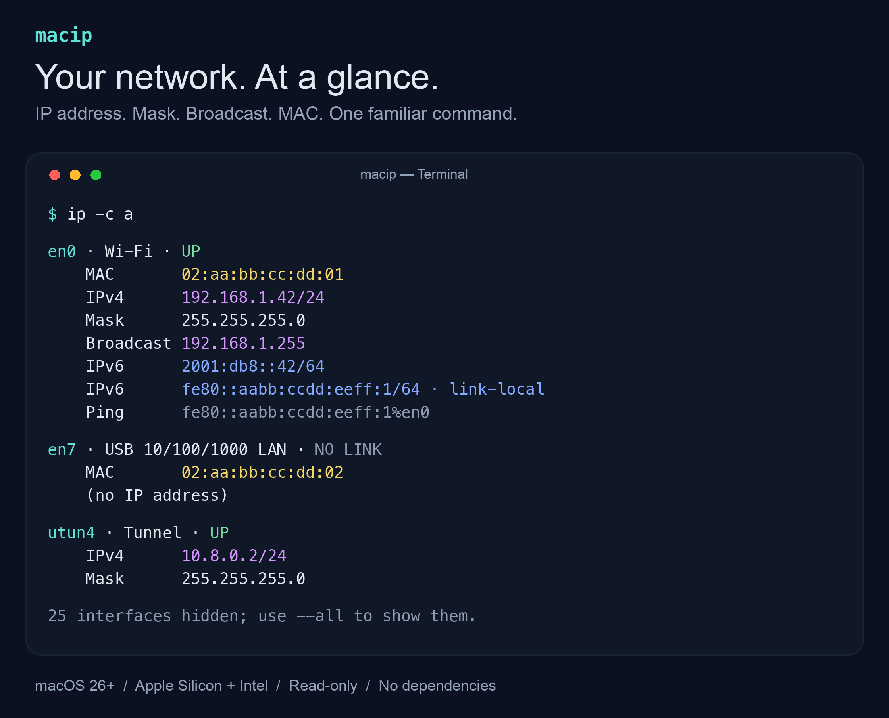

# macip

**Your network. At a glance.**

Used to `ip -c a` on Linux? Bring that habit to your Mac. See your **IP address, subnet mask, broadcast and MAC address** in a clean, color-coded view.



*Illustrative output with example addresses. Colors match the terminal output.*

A small, read-only Swift CLI for **macOS 26+**, **Apple Silicon and Intel**. No third-party dependencies, no root access, no network probes.

- **Find it fast.** Aligned fields and distinct colors make addresses easy to spot.
- **See what matters.** Wi-Fi, physical Ethernet ports and configured connections stay visible; auxiliary interfaces stay out of the way.
- **Bring your docks.** USB and Thunderbolt Ethernet ports appear even without a cable, including multiple or chained docks.
- **Copy and go.** IPv6 stays readable; the separate `Ping` field includes the interface scope when needed.

## Install with Homebrew

```sh
brew tap jaromarko/macip https://github.com/JaroMarko/macip
brew install jaromarko/macip/macip
ip -c a
```

Installs a prebuilt universal binary for Apple Silicon and Intel. No Swift compiler is needed to use it. Both `macip` and `ip` are installed. If another package already provides `ip`, Homebrew reports the link conflict; existing executables are not overwritten automatically.

```sh
brew update
brew upgrade macip
```

## Usage

| Command | What you get |
| --- | --- |
| `ip -c a` | Relevant interfaces, with color |
| `ip a --all` | Every interface, including loopback |
| `ip a show en0` | One interface, even when normally hidden |
| `ip route` | Primary IPv4 and IPv6 service routes |
| `ip --help` | Supported commands |

`macip` and `ip` run the same tool. No arguments shows addresses; `a`, `addr` and `address` are equivalent.

Each interface uses aligned, labeled fields: current MAC address, IPv4/prefix, dotted Mask, Broadcast and IPv6/prefix. MAC and broadcast appear only when provided by the interface; neither is invented for tunnels. Wi-Fi MAC uses a single call to the system `ifconfig` tool to read the current address (including Private Wi-Fi Address), since the address API can return a placeholder. The optional call has a one-second deadline and falls back to hardware metadata if it fails or stalls. If macOS hides the current MAC, the hardware address is shown with a `hardware` label. This can differ from Private Wi-Fi Address. If neither is available, Wi-Fi MAC is labeled `unavailable`. Broadcast is IPv4 only.

With `-c`, interface names are cyan, MAC addresses yellow, IPv4 and broadcast magenta, IPv6 blue, and UP green. Labels and masks remain neutral.

IPv4 addresses include both the prefix length and dotted subnet mask. IPv6 shows a clean address with its prefix. For link-local IPv6, a separate `Ping` field contains the scoped address (`fe80::…%en0`) without the prefix, ready to copy as the destination for `ping6`. The default view keeps Wi-Fi (including disconnected Wi-Fi), present USB and PCIe/Thunderbolt Ethernet adapters even without a cable (including multiple or chained docks), connected links even before they get an IP, interfaces with IPv4 or non-link-local IPv6, and the primary IPv4/IPv6 interfaces. Unused virtual ports, internal Apple interfaces and link-local-only tunnels are hidden. Unknown types are retained conservatively. `--all` shows everything; `a show NAME` always shows the requested interface.

`UP` is an administrative interface state, not proof that the Internet works. `NO LINK` uses the system link state when available, and `NO IP` means no address has been assigned. Tunnel interfaces are not automatically identified as VPNs. `route` shows primary service routing information, not the complete routing table.

## Build

Install Xcode Command Line Tools, then:

```sh
swift build -c release
.build/release/macip -c a
```

For a source build, you can use familiar Linux spelling with a shell alias:

```sh
alias ip=macip
```

The tool only reads local network information. It does not change settings, request root privileges, send network probes, collect telemetry, or store addresses. Color is opt-in with `-c`, disabled for pipes, `NO_COLOR`, and dumb terminals.

## Verify

```sh
swift build --product macip
swift run MacIPChecks
bash scripts/check-cli.sh .build/debug/macip
```

Checks cover IPv4/IPv6 masks, compact Darwin socket data, MAC parsing, interface filtering, chained-dock provider classification, subprocess failure/deadline behavior, CLI arguments and color handling in both pipes and terminals.

For a repeatable local speed check:

```sh
swift build -c release
python3 scripts/benchmark.py .build/release/macip
```

## Release

Push a `v*` version tag to build a universal Apple Silicon/Intel binary in GitHub Actions. The release includes an archive and SHA-256 checksum. The tag must match the binary version. Update the version, URL, SHA-256 and version assertion in `Formula/macip.rb` after each release, then push the formula update.

MIT licensed.
